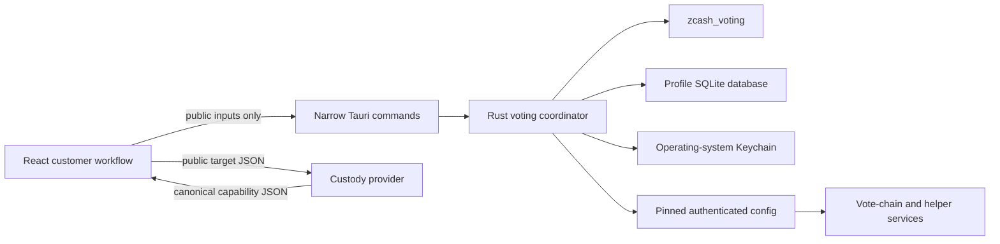
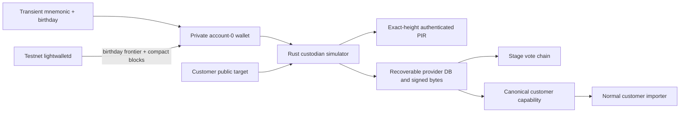
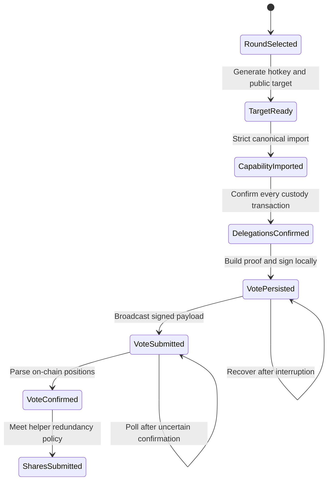

# Architecture

## Why a desktop app

The customer tool owns a small but security-sensitive secret and must run the native Zcash voting proof stack. Tauri keeps the presentation layer lightweight while placing hotkey generation, capability validation, persistence, networking, proof generation, signing, and recovery in Rust. A Vizor fork would inherit wallet and spending-key scope that this customer tool does not need. A hosted browser app would introduce browser storage and WebAssembly constraints at the most sensitive boundary.

The hotkey travels only between `zcash_voting`, zeroizing Rust buffers, and the operating-system Keychain. It is deliberately absent from every command response and frontend type.

## Testnet custodian simulator

The Testnet-only integration harness is a second, explicitly marked trust boundary. It is not part of the production customer path.

The mnemonic is parsed into zeroizing Rust containers and used to create only ZIP-32 account 0. The app requests the commitment-tree frontier immediately before the supplied birthday, creates a private wallet database, and scans contiguous compact blocks through the round snapshot in bounded batches. The same transient seed derives the Orchard spend-authorizing key for the synthetic governance signature. It is never persisted or returned.

Each job is bound to the authenticated chain, round parameters, snapshot height, exact customer target, wallet birthday, account-0 UUID, and seed fingerprint. The provider database holds note selection, witness, proof, and VAN commitment recovery state. The manifest holds canonical submission JSON plus the exact protobuf transaction bytes and their SHA-256 hashes. Both are written before the first network submission. A retry with the same seed and birthday resumes the wallet scan or proof job, checks the vote chain for each exact hash, and only rebroadcasts the same signed body when necessary.

New proofs and unfinished broadcasts require an active round. A fully accepted saved capability remains loadable after the round closes when the same mnemonic and birthday are supplied. The recovered wallet is removed after every bundle and the capability have been durably persisted; it remains only while an incomplete sync or proof job needs it for recovery.

## Profile isolation

Each profile has an independent directory, database wallet identifier, manifest, and Keychain service:

| Profile | Zcash network | Vote chain | Local directory |
| --- | --- | --- | --- |
| Mainnet | Mainnet | `zvote-1` | `mainnet/` |
| Testnet | Testnet | `svote-1` | `testnet/` |
| Local Demo | Regtest | `custody-voter-demo-1` | `demo/` |

Commands always receive an explicit profile. The backend checks that the profile, chain identifier, network, round identifier, and trusted round parameters agree before acting.

## State transitions

The database is the recovery source of truth after a vote commitment is built. A retry never rebuilds a commitment with a different selection under the same bundle and proposal key.

## Network authentication

Mainnet and Testnet each begin with a source URL and SHA-256 checksum embedded in `chain.rs`. `zcash_voting` verifies that static document, follows and authenticates its dynamic configuration, and constructs trusted round parameters with the authenticated election-authority key. Rounds not named by the resolved configuration are excluded.

All remote requests run in Rust with TLS, connect and total timeouts, failover across configured endpoints, response-size limits enforced while streaming, and no WebView network permission.

## Backup and restore

An export checkpoints SQLite, reads every round hotkey from Keychain, serializes one profile, and encrypts the envelope with age scrypt passphrase encryption. Sensitive serialized fields are zeroized when the envelope is dropped.

Restore performs these checks before activation:

1. age decryption and format/profile validation;
2. an exact, duplicate-free match between manifest rounds and hotkeys;
3. SQLite parsing, integrity checking, network checks, and rejection of unexpected rounds;
4. reconstruction of every hotkey and exact regeneration of its stored public target;
5. capture of the current Keychain state for rollback;
6. Keychain replacement and atomic database/manifest activation.

Only the selected profile is replaced. If file activation fails, the prior Keychain state is restored.

Test custodian jobs live outside the customer profile backup envelope. Export and restore never include the recovered wallet, mnemonic, provider database, delegation proof state, or provider-side transaction manifest.
